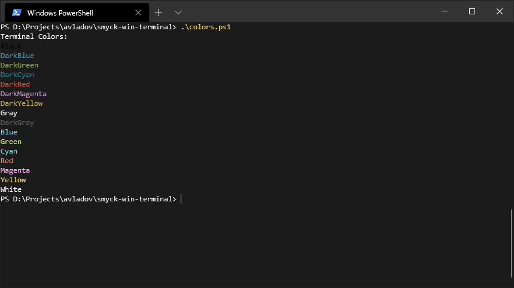

# SMYCK theme for [Windows Terminal][win-term]

**SMYCK** theme for Windows Terminal

_Based on the original [SMYCK][smyck] theme. All credits goes to the original author._

## Screenshots



## Installation

* Open Windows Terminal `profile.json` (`Ctrl + ,`)
* Find the `schemas` section
* Paste [smyck.json][json] in the list:

    ```json
    {
        "background": "#1B1B1B",
        "black": "#000000",
        "blue": "#4E90A7",
        "brightBlack": "#5D5D5D",
        "brightBlue": "#9CD9F0",
        "brightCyan" : "#77DFD8",
        "brightGreen" : "#CDEE69",
        "brightPurple" : "#FBB1F9",
        "brightRed" : "#E09690",
        "brightWhite" : "#F7F7F7",
        "brightYellow" : "#FFE377",
        "cyan" : "#218693",
        "foreground" : "#F8F8F8",
        "green" : "#8EB33B",
        "name" : "SMYCK",
        "purple" : "#C8A0D1",
        "red" : "#C75646",
        "white" : "#B0B0B0",
        "yellow" : "#D0B03C"
    }
    ```

* Find `profiles` section and change color scheme to `SMYCK` for the desired entries. Example:

    ```json
    "profiles":
    [
        {
            "acrylicOpacity" : 0.5,
            "closeOnExit" : true,
            "colorScheme" : "SMYCK",
            "commandline" : "powershell.exe",
            "cursorColor" : "#FFFFFF",
            "cursorShape" : "bar",
            "fontFace" : "SMYCK",
            "fontSize" : 10,
            "guid" : "{61c54bbd-c2c6-5271-96e7-009a87ff44bf}",
            "historySize" : 9001,
            "icon" : "ms-appx:///ProfileIcons/{61c54bbd-c2c6-5271-96e7-009a87ff44bf}.png",
            "name" : "Windows PowerShell",
            "padding" : "0, 0, 0, 0",
            "snapOnInput" : true,
            "startingDirectory" : "%USERPROFILE%",
            "useAcrylic" : false
        },
        {
            "acrylicOpacity" : 0.75,
            "closeOnExit" : true,
            "colorScheme" : "SMYCK",
            "commandline" : "cmd.exe",
            "cursorColor" : "#FFFFFF",
            "cursorShape" : "bar",
            "fontFace" : "Consolas",
            "fontSize" : 10,
            "guid" : "{0caa0dad-35be-5f56-a8ff-afceeeaa6101}",
            "historySize" : 9001,
            "icon" : "ms-appx:///ProfileIcons/{0caa0dad-35be-5f56-a8ff-afceeeaa6101}.png",
            "name" : "cmd",
            "padding" : "0, 0, 0, 0",
            "snapOnInput" : true,
            "startingDirectory" : "%USERPROFILE%",
            "useAcrylic" : true
        },
        ...
    ```

    _PowerShell might have `background` value in profiles. Make sure to remove it._

## License

[MIT License][license]

[win-term](https://github.com/microsoft/terminal)
[smyck](https://github.com/hukl/Smyck-Color-Scheme/)
[license](./LICENSE)
[json](./smyck.json)